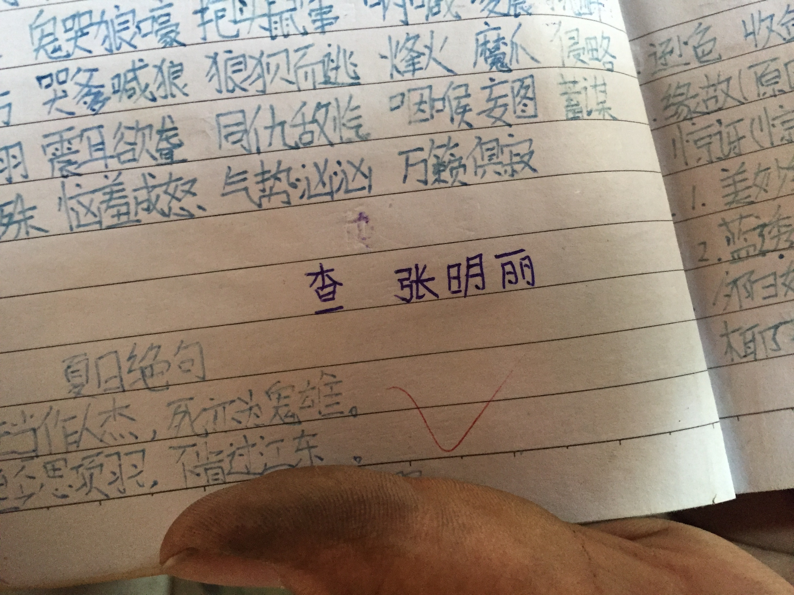

（日期待确认）

这一页是妈妈学生时代的语文作业，写着一串词语和古诗《夏日绝句》，我想留住它是因为这是妈妈年少时一笔一画写下的字迹。

作业页上有蓝钢笔抄写的词语：鬼哭狼嚎、抱头鼠窜、哭爹喊狼〔原图如此，疑为“哭爹喊娘”〕、狼狈而逃、烽火、魔爪、侵略、震耳欲聋、同仇敌忾、咽喉、妄图、蓄谋、恼羞成怒、气势汹汹、万籁俱寂；下方抄有《夏日绝句》：“生当作人杰，死亦为鬼雄。至今思项羽，不肯过江东。”并配有简笔画。页边有“查 张明丽”的签名〔签名身份不确定，可能是批改者，也可能就是妈妈本人〕。

