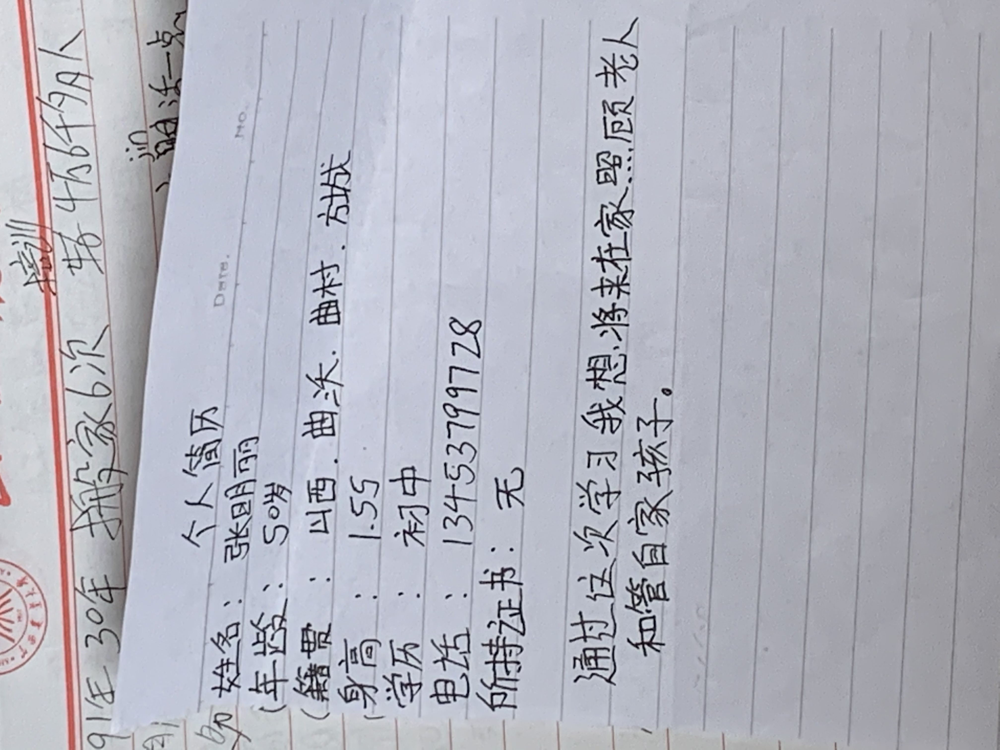

（日期待确认）

这一页是妈妈手写的个人简历，写的是她的姓名、年龄、籍贯和心愿，我想留住它是因为上面有妈妈亲笔写下的每一个字。

转写如下：个人简历；姓名：张明丽；年龄：50岁；籍贯：山西·曲沃·曲村·放城〔“放城”疑为“方城”，此处不确定〕；身高：1.55；学历：初中；电话：13453799728；所持证书：无。末尾写道：“通过这次学习我想将来在家照顾老人和管自家孩子。”纸张左侧露出另一页的边角，能看见“培训”“4万6千多个人”“搬家6次”“91年30年”“生活法一点”等字（个别字看不清）。

