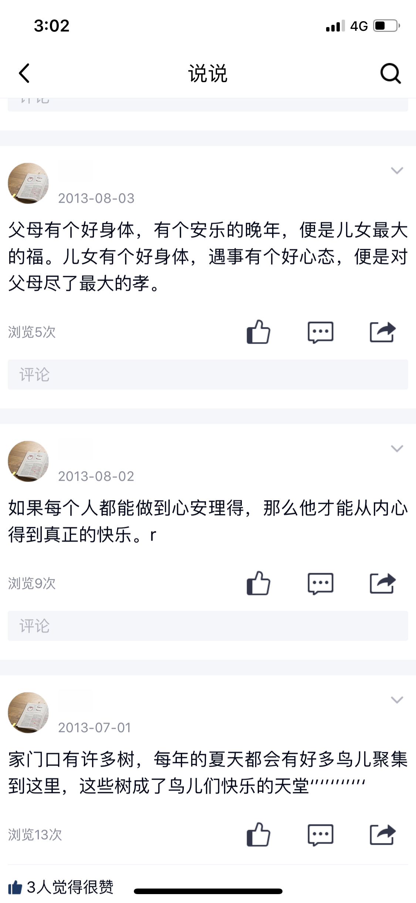

这一页有三条妈妈的说说，写的是父母的福气、心安理得和家门口的树与鸟，我想留住它是因为这些话里全是妈妈的心。

2013-08-03：“父母有个好身体，有个安乐的晚年，便是儿女最大的福。儿女有个好身体，遇事有个好心态，便是对父母尽了最大的孝。”；2013-08-02：“如果每个人都能做到心安理得，那么他才能从内心得到真正的快乐。”；2013-07-01：“家门口有许多树，每年的夏天都会有好多鸟儿聚集到这里，这些树成了鸟儿们快乐的天堂``````”〔引号处原图如此〕。


