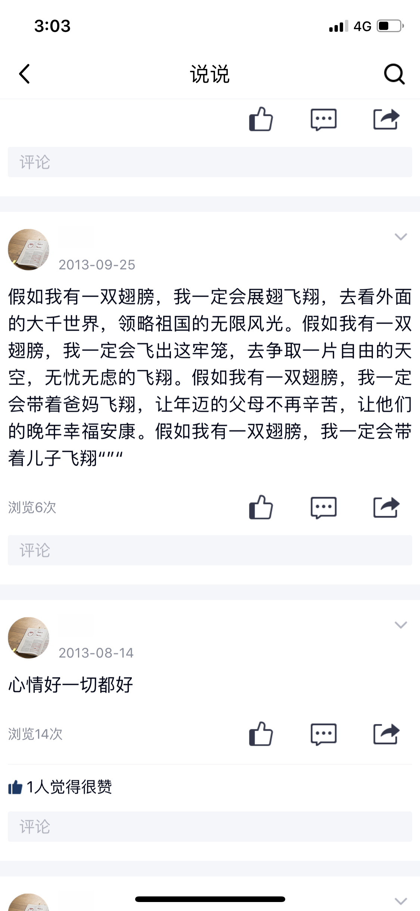

这一页的说说写的是“假如我有一双翅膀”要带爸妈飞、带儿子飞，我想留住它是因为妈妈把一辈子的愿望都写在了这里。

2013-09-25：“假如我有一双翅膀，我一定会展翅飞翔，去看外面的大千世界，领略祖国的无限风光。假如我有一双翅膀，我一定会飞出这牢笼，去争取一片自由的天空，无忧无虑的飞翔。假如我有一双翅膀，我一定会带着爸妈飞翔，让年迈的父母不再辛苦，让他们的晚年幸福安康。假如我有一双翅膀，我一定会带着儿子飞翔""""”〔末尾符号原图如此〕；2013-08-14：“心情好一切都好”。

