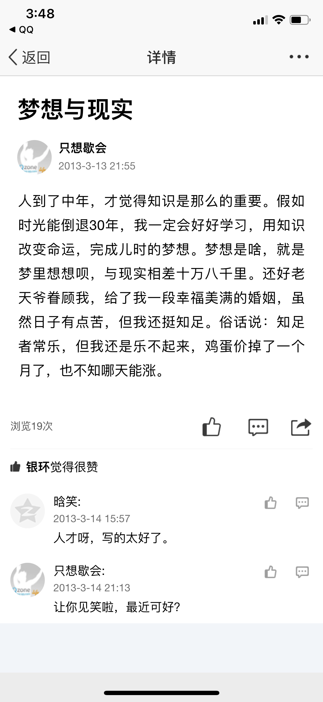

这一页说说写的是“梦想与现实”，从后悔没好好读书写到鸡蛋掉价，我想留住它是因为这就是妈妈真实、可爱又辛酸的日子。

2013-3-13 21:55 发的说说（标题“梦想与现实”，发布者“只想歇会”）：“人到了中年，才觉得知识是那么的重要。假如时光能倒退30年，我一定会好好学习，用知识改变命运，完成儿时的梦想。梦想是啥，就是梦里想想呗，与现实相差十万八千里。还好老天爷眷顾我，给了我一段幸福美满的婚姻，虽然日子有点苦，但我还挺知足。俗话说：知足者常乐，但我还是乐不起来，鸡蛋价掉了一个月了，也不知哪天能涨。”浏览19次，“银环觉得很赞”。晗笑评论：“人才呀，写的太好了。”妈妈回复：“让你见笑啦，最近可好?”

