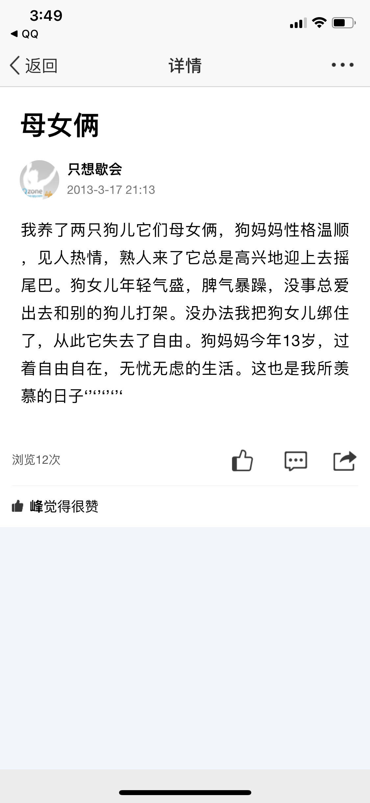

这一页说说写的是妈妈养的一对母女狗，狗妈妈自由自在、狗女儿被拴住，我想留住它是因为妈妈借狗说人，说出了自己羡慕的日子。

2013-3-17 21:13 发的说说（标题“母女俩”）：“我养了两只狗儿它们母女俩，狗妈妈性格温顺，见人热情，熟人来了它总是高兴地迎上去摇尾巴。狗女儿年轻气盛，脾气暴躁，没事总爱出去和别的狗儿打架。没办法我把狗女儿绑住了，从此它失去了自由。狗妈妈今年13岁，过着自由自在，无忧无虑的生活。这也是我所羡慕的日子“”“”“”“”〔末尾符号原图如此〕。”浏览12次，“峰觉得很赞”。

