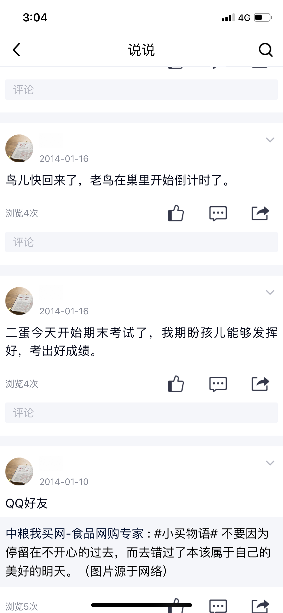

这一页说说写的是“鸟儿快回来了，老鸟在巢里开始倒计时了”，我想留住它是因为妈妈一直用老鸟称呼自己。

2014-01-16：“鸟儿快回来了，老鸟在巢里开始倒计时了。”；2014-01-16：“二蛋今天开始期末考试了，我期盼孩儿能够发挥好，考出好成绩。”；2014-01-10 转发“中粮我买网”：“#小买物语# 不要因为停留在不开心的过去，而去错过了本该属于自己的美好的明天。（图片源于网络）”

