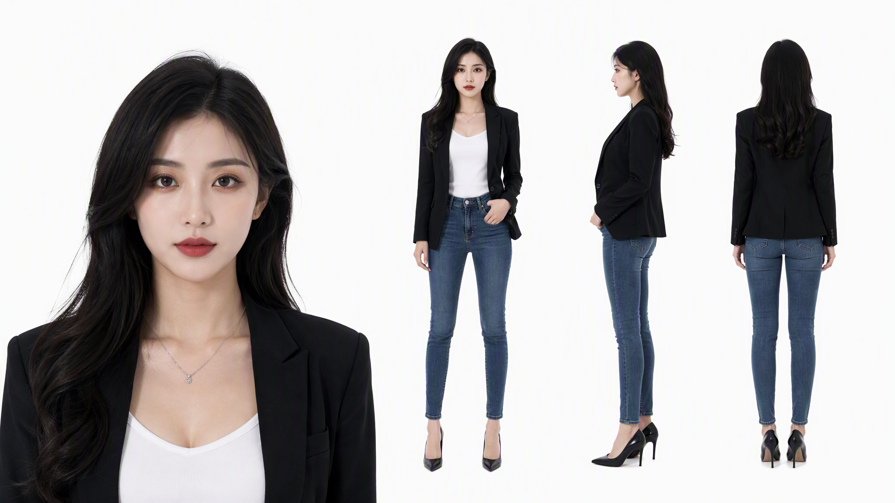
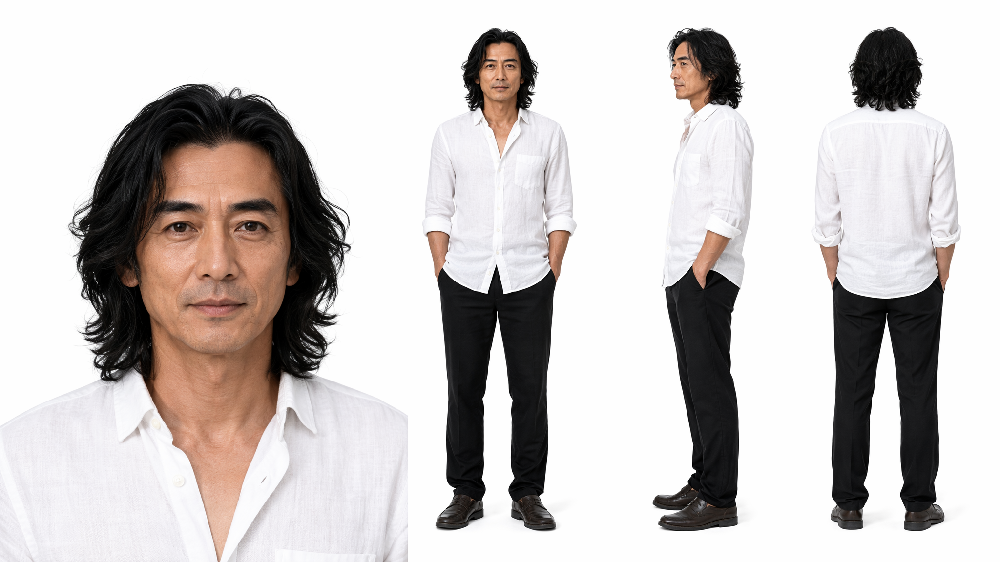

[苏晴，女，青年，中国]
【剧情身份】：刚买房不久的年轻公寓房主
【五官与面部】
脸型：精致的瓜子脸，下巴微尖
眉型：精致的平眉
眼型：明亮有神的大眼睛，眼角微微上扬
鼻型：挺直秀气的鼻梁
唇型：饱满的红唇，嘴角微抿
肤色：白皙透亮，皮肤质感极佳
头发：黑色中长发，发质柔顺，自然披散在双肩
【身材比例】：身高约168cm，身材高挑苗条，仪态优雅
【妆造】：精致的都市全妆，眼影与口红色彩搭配协调，略显高冷
【服装】：身穿一件剪裁得体的黑色时尚西装外套，内搭一件白色低领打底衫，颈部戴着一条细银项链；下身穿修身牛仔裤，整体造型简约而时尚。
【风格要求】：真人实拍风格，真实人物比例与皮肤质感。

[小陈，女，青年，中国]
【剧情身份】：热情、专业的房产中介
【五官与面部】
脸型：圆润亲切的鹅蛋脸
眉型：自然柔和的弯眉
眼型：明亮的大眼睛，透着机灵与热情
鼻型：小巧挺立的鼻子
唇型：自然红润的嘴唇，常带职业微笑
肤色：白皙细腻，气色红润
头发：黑色齐肩短发，三七侧分，发梢微内扣，显得干练
【身材比例】：身高约162cm，身材匀称，仪态端庄
【妆造】：精致的职业淡妆，口红颜色自然，突出亲和力
【服装】：身穿修身的黑色职业西装外套，内搭白色木耳边立领衬衫，左胸前佩戴着蓝底白字的“安家地产”圆形工牌；下身穿黑色西装直筒裤，脚穿黑色中跟皮鞋。
【风格要求】：真人实拍风格，真实人物比例与皮肤质感。

[林远，男，中年，中国]
【剧情身份】：买房客户，看似普通但实力雄厚的父亲
【五官与面部】
脸型：瘦削，轮廓分明，面部线条坚毅
眉型：浓密的剑眉，略带沧桑感
眼型：深邃的双眼皮，眼神温和而坚定
鼻型：高挺笔直的鼻梁
唇型：薄唇，嘴角带着一丝不易察觉的温和笑意
肤色：健康的小麦色，有岁月留下的沧桑感
头发：黑色长发，微卷，长度及肩，略显凌乱但极具艺术家气质
【身材比例】：身高约178cm，体型偏瘦但挺拔
【妆造】：无明显妆感，呈现自然的皮肤纹理与微小的岁月痕迹
【服装】：身穿一件质地柔软的白色长袖棉麻衬衫，领口微敞，袖口随意挽起至前臂；下身搭配一条合体的黑色休闲长裤，脚穿深色皮质休闲鞋。
【风格要求】：真人实拍风格，真实人物比例与皮肤质感。
  
真人角色基础设定模板
[姓名，性别，年龄阶段，国籍]
【剧情身份】：[角色在故事中的身份、职业、关系]
【五官与面部】
脸型：
眉型：
眼型：
鼻型：
唇型：
肤色：
头发：
【身材比例】：身高约……cm，体型……，仪态……
【妆造】：……
【服装】：上装……，内搭……，配饰……；下装……，鞋……。
【镜头与构图】：[特写 / 半身 / 全身 / 三视图]，[35mm / 50mm / 85mm]
【光线与氛围】：[自然光 / 柔光棚拍 / 黄昏逆光 / 室内暖光]
【场景与背景】：[现代公寓 / 房产门店 / 城市街头 / 极简纯色]
【表情与姿态】：[微抿 / 职业微笑 / 温和笑意 / 站立 / 侧身 / 回眸]
【输出用途】：[定妆照 / 三视图 / 表情集 / 剧情场景图 / 商品海报]
【风格要求】：真人实拍风格，真实人物比例与皮肤质感，自然光影，真实皮肤纹理。
【负面提示词】：卡通，3D，过度磨皮，比例失真，畸形手指，多余肢体。
【模型兼容】：ChatGPT Image / Midjourney / Flux / Gemini

