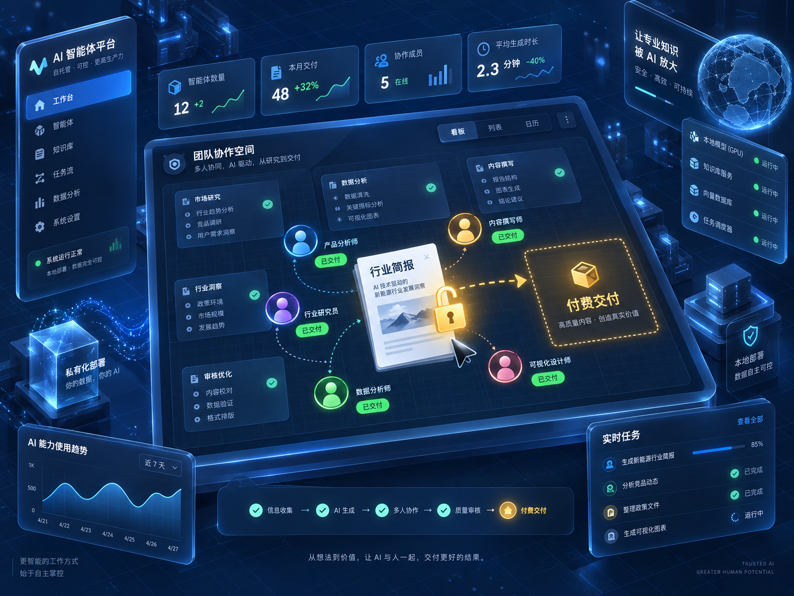

最近我越来越觉得，AI 一人公司这件事，真正的分水岭已经不是“会不会用工具”了。

外滩大会专门设了一个“超级个体日”，17 位超级个体上台亮相，“一人公司”开始从一个概念，慢慢变成一批真实的人。

另一边，组织也在重新算账。

有公司开始直接比较“人力成本”和“token 成本”，再决定哪些岗位继续留人，哪些工作应该交给 AI。甚至有团队负责人，是等名单回传之后才知道最终裁员范围。

这两件事放在一起看，其实挺有意思。

一边是个人被 AI 放大，一边是公司开始重新计算人的价值。

所以我现在越来越不关心一个人又学会了什么新工具。

我更关心一个问题：

你能不能靠这些工具，收回第一笔钱。

这可能才是 AI 时代对普通人最现实的一次测试。

会用 AI，已经越来越不值钱了

去年大家还会因为“能用 AI 做 PPT”“能用 AI 写代码”“能搭 Agent”觉得很新鲜。

现在不会了。

这些东西正在快速变成基础能力。

就像十年前会用 Excel，后来变成了默认能力一样。

真正稀缺的，不再是“你会不会”，而是：

你到底能不能拿它解决一个别人愿意付费的问题。

这两者差别很大。

很多人现在的问题，是每天都在学工具。

今天学一个 Agent 框架，明天学一个自动化平台，后天又研究新模型。

看起来进步很快，但如果你问一句：

现在有没有人愿意因为你的能力，付你 500 块钱？

很多人会突然卡住。

这其实才是最应该验证的地方。

第一个付费信号：有人愿意花钱买你的“省事”

普通人最容易卖出去的，不是什么高科技。

往往就是省时间、省麻烦。

比如一个老板每周要花 3 个小时整理客户反馈。

你用 AI 帮他压到 20 分钟。

对你来说，这可能只是一个简单工作流。

但对他来说，这是真金白银的时间。

所以你不要卖：

“我会搭 Agent。”

也不要卖：

“我会用 Claude、ChatGPT、Codex。”

客户不关心。

你应该卖的是：

“这件事原来要 3 小时，我帮你做到 20 分钟。”

这句话才开始接近生意。

很多人总想着先做一个完整产品，再找客户。

其实顺序反了。

你完全可以先找一个具体的人，帮他解决一次具体问题，哪怕只收 199、299、500。

如果他下一次还愿意找你，这才是信号。

如果他说“真厉害”“以后有机会合作”，但从来不掏钱，那基本不算。

第二个付费信号：你能不能稳定交付，而不是偶尔做出来一次

AI 最大的问题之一，就是它很容易让人产生一种错觉：

“我已经会了。”

但你自己演示成功一次，和你给别人连续交付十次，是完全不同的能力。

比如：

你可以自动生成一份行业简报。

这不稀奇。

真正值钱的是：

每周一早上，对方都能稳定收到一份能看的行业简报。

数据别错。

格式别崩。

重点别跑偏。

出了问题有人兜底。

这才叫交付。

所以我现在看 AI 项目，不太看 Demo。

我更看：

这个东西能不能重复交付。

如果只能在你自己电脑上偶尔成功一次，那是实验。

如果能连续给 5 个真实用户用，而且他们觉得有价值，那才开始有一点生意的味道。

现在很多 Agent 平台已经把技术门槛降得很低。

这其实是好事。

因为你终于没必要再把“技术难”当借口。

工具已经够用了。

接下来真正要验证的是：

你能不能把它变成一个稳定结果。

第三个付费信号：客户最后买的，可能不是 AI，而是你

这一点很多人容易低估。

AI 会越来越便宜。

工具也会越来越同质化。

今天你会的工作流，过半年别人可能一键就能复制。

那最后什么东西最难复制？

其实还是人。

你的判断。

你的审美。

你的筛选。

你的经验。

还有别人对你的信任。

同样一份 AI 行业信息，有些人发出来没人看。

有些人发出来，大家愿意等。

区别不一定是信息本身。

而是读者知道：

这个人会帮我过滤垃圾。

这件事很重要。

未来很多 AI 生意，表面上卖的是内容、咨询、服务、工具。

底层卖的其实都是一句话：

“我相信你替我做判断。”

这也是为什么，我觉得普通人做 AI，最后不能只剩下一堆工具教程。

如果你只是教大家今天哪个模型更新了，明天哪个 Agent 又出了新功能，那你的价值很容易被下一个博主替代。

真正值得积累的是：

你在一个领域里，持续做判断。

持续交付结果。

慢慢让别人产生一种感觉：

“这件事我不想自己研究了，我直接找你。”

到这一步，生意才开始变稳。

所以，普通人现在最该做的，不是继续补课

我越来越不建议普通人把大量时间花在“把所有 AI 工具学会”这件事上。

学不完。

而且没必要。

你现在更应该做三件很小的事。

先选一个你已经能做的具体任务。

不要大。

比如：

帮商家整理客户反馈。

帮一个行业做周报。

帮一个销售整理线索。

帮一个内容团队做选题。

帮一个小公司做重复性的资料整理。

然后用 AI 把它做快。

接着找一个真实的人，尝试收第一笔钱。

最后记录：

他为什么愿意付钱？

他为什么不愿意付钱？

他真正看重的是速度、结果、信任，还是别的东西？

这个过程，比你再学十个工具有价值得多。

因为工具给你的，是能力感。

收费给你的，才是现实反馈。

AI 一人公司，最后拼的不是“会多少”

我现在对“一人公司”最大的理解，不是一个人会做十个人的活。

那只是表面。

真正的变化是：

以前一个普通人想验证一个生意，需要团队、开发、设计、运营。

现在你可以先自己把大部分东西跑起来。

这才是 AI 真正放大个人的地方。

但放大之后，你还是要面对最老的问题：

有没有人愿意付钱。

没有这一步，再漂亮的 Agent，再复杂的自动化，再多的工具，最后都只是自我感动。

所以如果你最近也在研究 AI、Agent、一人公司，我建议你先别急着搭大系统。

先做一件小事。

先服务一个人。

先收一笔钱。

因为到了今天，最稀缺的已经不是“会不会用 AI”。

而是：

你能不能把 AI 变成一个别人愿意付钱的结果。
