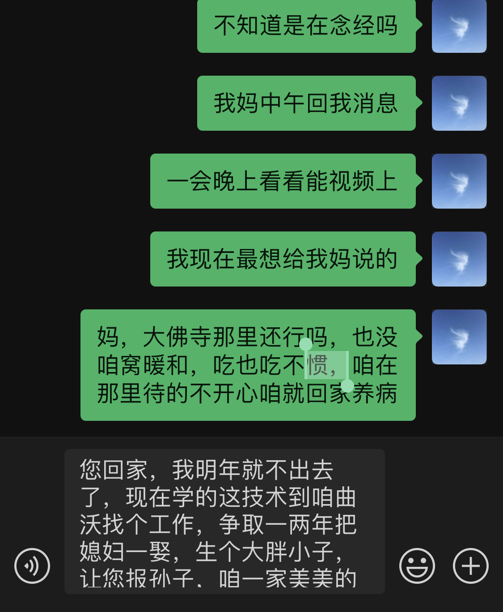

（日期待确认）

这一页聊天记录是我对妈妈说的话，问她大佛寺那里行不行、住不惯就回家养病，还说回家后明年就不出去了，我想留住它是因为这些话我平时说不出口。

我对妈妈说：“不知道是在念经吗”“我妈中午回我消息”“一会晚上看看能视频上”“我现在最想给我妈说的”“妈，大佛寺那里还行吗，也没咱窝暖和，吃也吃不惯，咱在那里待的不开心咱就回家养病”；还写：“您回家，我明年就不出去了，现在学的这技术到咱曲沃找个工作，争取一两年把媳妇一娶，生个大胖小子，让您抱孙子，咱一家美美的”。〔后一段是输入框里的设想文字，是否发出不确定〕

