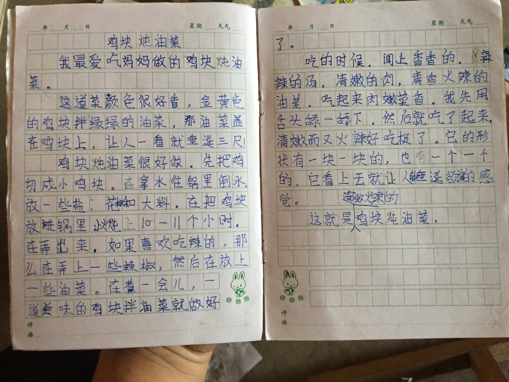

（日期待确认）

照片里是我小时候写的作文《鸡块炖油菜》，写妈妈做的这道菜，我想留住它是因为那是我第一次学着夸妈妈的手艺。

作文转写如下（保留小学生写法，未改动）：“我最爱吃妈妈做的鸡块炖油菜。这道菜颜色很好看，金黄色的鸡块拌绿绿的油菜，那油菜盖在鸡块上，让人一看就垂涎三尺！鸡块炖油菜很好做。先把鸡切成小鸡块。在拿水往锅里倒水，放一些盐：花椒和大料。在把鸡块放进锅里：炖上10一11个小时。在弄出来，如果喜欢吃辣的，那么在弄上一些辣椒，然后在放上一些油菜。在煮一会儿，一道美味的鸡块拌油菜就做好了。吃的时候，闻上香香的，辣辣的汤，清嫩的肉，清香火辣的油菜。吃起来肉嫩菜香。我先用舌头舔一舔下，然后就吃了起来，清嫩而又火辣好吃极了。它的形状有一块一块的，也有一个一个的，它看上去就让人垂涎欲滴的感觉。清嫩火辣的这就是鸡块炖油菜，……”

