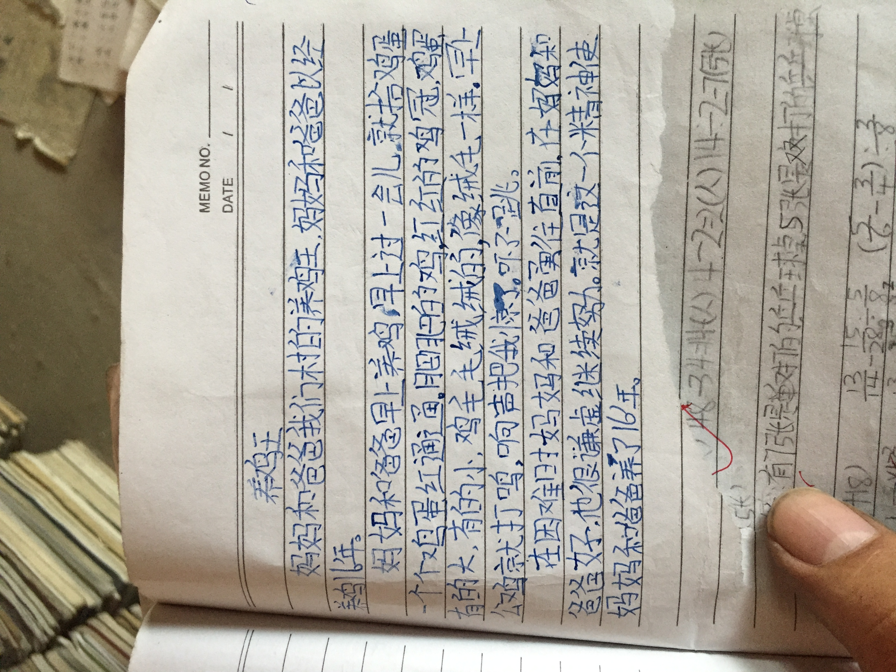

（日期待确认）

照片里是我写的《养鸡王》，写爸爸妈妈养了16年鸡，我想留住它是因为那16年，就是爸妈把我养大的16年。

作文转写如下（保留小学生写法，未改动）：“妈妈和爸爸我们村的养鸡王，妈妈和爸爸已经养了几年。妈妈和爸爸早上养鸡，早上过一会儿就拾鸡蛋，一个个鸡蛋红通通，肥肥的鸡，红红的鸡冠，鸡有的大，有的小，鸡毛毛绒绒的，像绒毛一样。早上公鸡就打鸣，响声把我惊了，吓了一跳。在困难时妈妈和爸爸勇往直前，在妈妈知道爸爸好，他很谦虚继续努力。就是这一个精神使妈妈和爸爸养了16年。”

